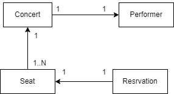

Assignment - Concert Reservation 
====================
 
# Total: 10 points 
In this assignment, you will develop a web application that will allow users to reserve seats for a concert. 

## Evaluation
- Running these unit tests will evaluate your work (8 points). The following summarises the points for each test:
    - `ConcertRepositoryTest` (2 points for each method) - 4 points
    - `ConcertControllerTest` (2 points for each method) - 4 points
- Complete the views (2 points)
    - `book.html` - 1 point
    - `reserve-seat.html` - 1 point

## Task1 - Develop Model
We will develop Model that has 3 entity classes according to the figure below.



- `Concert`  will represent a concert. Please add proper annotation to its attributes. 

- `Performer` will represent a performer. Please add proper annotation to its attributes. 

- `Seat` will represent a seat. Please add proper annotation to its attributes.

- `Reservation` will represent a reservation. Please add proper annotation to its attributes.


### Relationship
The relationship between the entities are as follows:
* `Concert` has a relationship with `Performer`. This is a one-to-one relationship. A concert has one performer and a performer can perform in a concert. Please use `CascadeType.ALL` for this relationship, as we want to save/delete the performer when we save/delete the concert.

* `Seat` has a relationship with `Concert`. This is a many-to-one relationship. Many seats can belong to a concert. Please use `CascadeType.MERGE` for this relationship, as we want to save the seat to an existing concert.

* `Reservation` has a relationship with `Seat`. This is a one-to-one relationship.  Please use `CascadeType.MERGE` for this relationship, as we want to save the reservation to an existing seat.


There is `data.sql`, which initializes the database with some data. You can use this data to test your application.


###  Repository classes
- `ConcertRepository`, `ReservationRepository` and  `SeatRepository` are complete. No modification needed.

We will use H2 as a database for this lab. Please make sure the configuration in `application.properties` is correct.


## Task2 - Develop Controller
This controller is similar to the previous lab, but we will add a new controller method to show the reservation form and a method to save the reservation. Please complete the following methods:

- `book` should be called by GET `/book`. This method should show the concerts to book. The method should:
    * add all concerts to model
    * **return** `book` view

- `reserveSeatForm` should be called by GET `/book/concerts/{concertId}`, where `concertId` is concertId to book. The method should:
    * adds empty reservation to model
    * find concert by id and add it to model
    * find available seats, where `booked` is `true` for the given concert id and add it to model (Look at `SeatRepository` class for the findBy... method that suite this purpose)
    * **return** `reserve-seat` view

- `reserveSeat` should be called by POST `/book/concerts/{concertId}`, where `concertId` is concertId to book. The method should:
    * find selected seat by id
    * set selected seat's `booked` to true
    * save seat
    * save reservation
    * **redirect** to the first page `/book`


## Task3 Develop Views
You need to modify the following views:
- `book.html` - add columns to shows title, date and performer name
- `reserve-seat.html` - complete a form to reserve a seat for a concert

Modify **all** views (including `list-concert.html`, `seat-mgmt.html` and `add-concert-form.html`) to look beautiful by adding CSS. You can use Bootstrap or any other CSS framework. You can also use your own CSS. You may adds some figure or icons to make the UI  **friendlier**. Please put the screenshots of modified views below.

**Put your screnshots here for 2 points**

## Test Web App using Browser
Run the application using App.java class. Open the browser and go to `http://xxxxx/book`, where xxxx is your hostname and port such as `localhost:8100` or on codespace: `xxxxxxx-8100.app.github.dev` .

- Click on book for a concert
- Enter your name and email, and choose seat click on book
- Click on book again for the same concert
- You should see selected seat is not listed as select anymore

## Unit Test
Run the unit tests in `ConcertControllerTest` class to test the service. You can run the tests using the following command:
```
mvn verify
```
